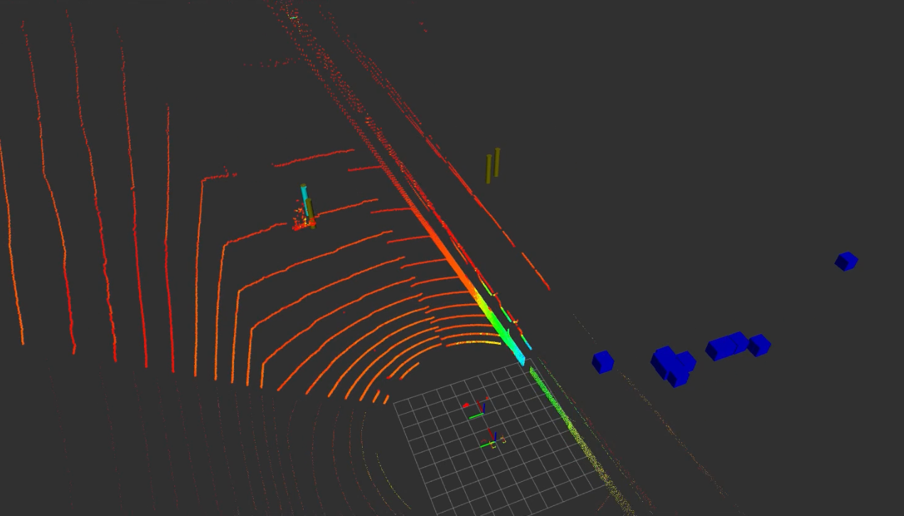

# ROS2 Python Radar Detection Filter Node

This package contains a radar detection filter node for ROS2 that processes `delphi_esr_msgs/msg/EsrTrack` and `visualization_msgs/msg/Marker` messages. The node subscribes to these messages, filters the incoming data, and publishes filtered data as `visualization_msgs/msg/Marker` messages. 


The cyan marker is the candidate detection after filtering

## Requirements

- ROS2 Foxy or later
- `delphi_esr_msgs` package
- `visualization_msgs` package

## Installation

1. Clone this package into the `src` directory of your ROS2 workspace:
```
cd ~/ros_ws/src
git clone <repository_url> radar_detection_filter_node
```

2. Build the package:
```
cd ~/ros_ws
colcon build --packages-select radar_detection_filter_node
```
3. Source the package:
```
source install/setup.bash
```

## Usage

1. Run the node:
```
ros2 run radar_detection_filter_node filter_node
```

## Node Information

### Subscribed Topics

- `/radar_front/esr_track` ([delphi_esr_msgs/msg/EsrTrack]): ESR track messages from the radar sensor.
- `/radar_front/radar_visz_static` ([visualization_msgs/msg/Marker]): Radar visualization marker messages.

### Published Topics

- `/radar_filtered` ([visualization_msgs/msg/Marker]): Filtered radar visualization marker messages.

### Node Behavior

The `FilterNode` class subscribes to the `/radar_front/esr_track` and `/radar_front/radar_visz_static` topics, which provide ESR track and radar visualization marker messages, respectively. The node filters the incoming data based on the range and speed of the detected objects and publishes the filtered data as `visualization_msgs/msg/Marker` messages to the `/radar_filtered` topic.

The node uses a deque buffer to store a history of received messages, and processes the data to determine the best candidate marker to publish.
